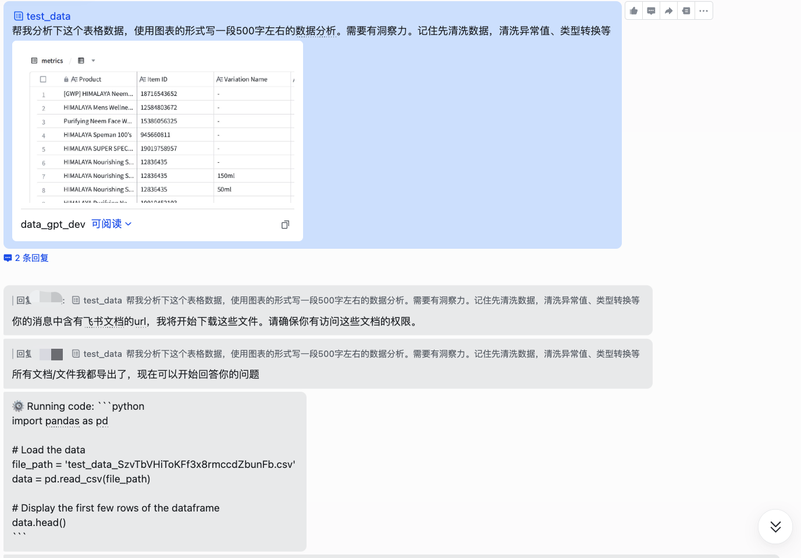
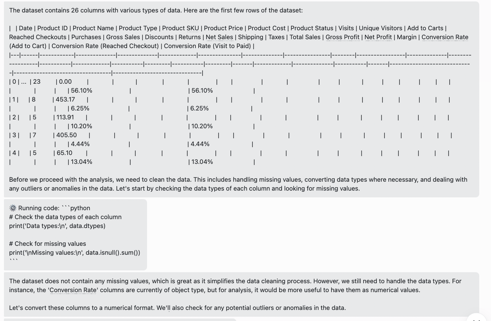
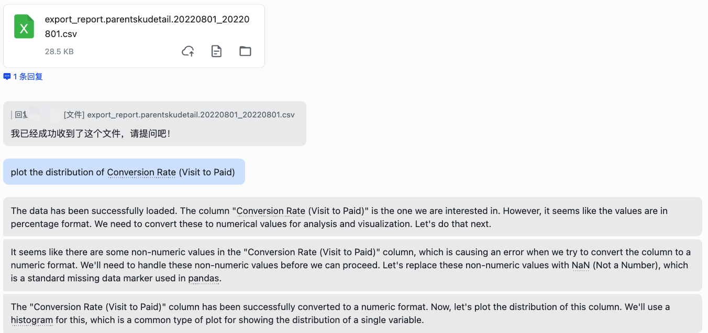
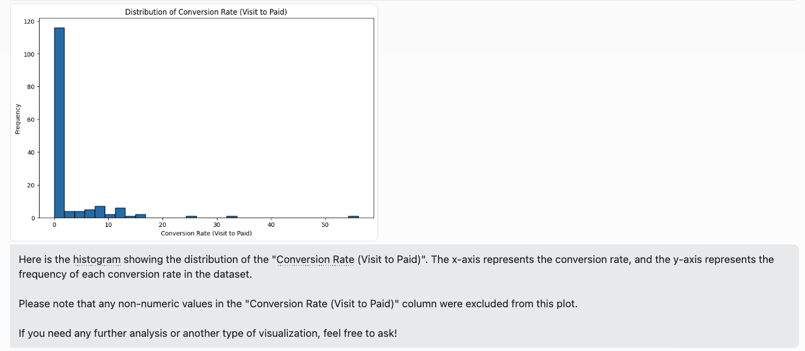

 
    AaaS(Agent as a Service)

   飞书/钉钉 Code Interpreter
 

<!-- 

   www.Aaas.world

 -->
<!-- 
 -->

🌉飞书/钉钉中基于ChatGPT的智能体（Agents）接入服务（Code Interpreter） 🌉

 

欢迎来到基于ChatGPT的智能体接入服务！此服务旨在为飞书和钉钉用户提供强大的Code Interpreter功能，助力企业更好地进行文档数据分析，并与自家数据库进行交互。

通过飞书机器人的形式提供全企业的交互服务

## 特性

1. **飞书、钉钉的云文档交互**  
   快速地在飞书或钉钉的云文档中与ChatGPT进行交互，提升工作效率。直接通过文档url的形式即可与Chatgpt交互，做进一步的数据处理和分析。
   
     

   **同时支持本地文件的上传后交互。**

   
   

2. **Code Interpreter 功能**  
   助力企业进行文档数据分析，同时提供与企业私有数据库的链接功能，使数据分析更加深入准确。

3. **支持多种Agents**  
   - 企业常见问题问答：关联知识库文档，提供针对性的解答，节省查询时间。如企业内部的报销流程、人事、政策等。
   - 长文档总结：快速得到文档的核心内容，支持超越token数的长文档的问答交互。
   ....

4. **企业数据隔离**  
   为了确保企业数据的安全性，我们严格执行数据隔离政策，确保各企业数据的独立与安全。

5. **正在进行中**
   - 正在研发支持企业部署本地大语言模型，加强信息安全。  
   - 自研多智能体系统(multi-agent-system) 参考Meta-gpt，助力企业在特定需求下的生产力升级（例如使用产品经理+程序员+测试的多智能体系统，在产品开发初始阶段进行需求拆解、系统架构设计、测试方案参考等）。

## 开始使用

请联系我们为您的企业部署,助力您的企业向智能化卖出第一步。 

- 掌控全局的Admin Panel: AI资源管理、对话日志查询、风险词规避和对话权限管理
- 专人技术支持: 配备专业部署交付人员与后期一对一维护服务
- 同时提供在线Saas版/企业级私有部署

企业客户咨询:
Wechat ID: zjajzzj1996  

Email: zhangzhehian@gmail.com  

感谢您选择我们的服务，祝您使用愉快！

## 关于我们
本服务由AaaS.world提供 （Agents as a Service） 

致力于为企业提供由数字化向智能化的转型。通过
